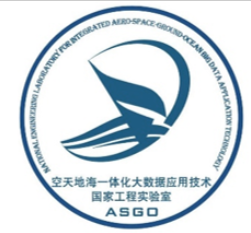

[](https://git.io/typing-svg)
## About me :point_down:
<p align="center">
  <a href="https://github.com/dadwadw233">
    
  </a>
  <a href="https://github.com/dadwadw233">
    
  </a>
  <a href="https://github.com/dadwadw233?tab=repositories">
    
  </a>
  <a href="https://gist.github.com/dadwadw233">
    
  </a>
  <a href="https://github.com/dadwadw233">
    
  </a>
</p>

### Introduction

- PhD student at Zhejiang University
- You can get in touch with me by email at [yuanhongyu.me@gmail.com](mailto:yuanhongyu.me@gmail.com)
- My HomePage: [YYH`s Homepage](https://yuanhongyu.xyz/)

---

### Education Experience

[](https://www.zju.edu.cn/)

**PhD student** \
[**@ZJU-3DV**](https://github.com/zju3dv) • 2024/09 -  \
Research Interests: `3DV`, `Embodied AI`  \
Reaserch Projects: [ICCV2025][BoxDreamer](https://github.com/zju3dv/BoxDreamer) 

[](https://www.nwpu.edu.cn/)

**Bachelor's degree** \
[**NPU**](https://www.nwpu.edu.cn/) • 2020/09/01 - 2024/06/30 \
Skills: `Python`, `C++`, `3D Vision`, `Robot` ...\
<br/>

---

### Work Experience

### 

[](https://www.nwpu.edu.cn/)

**3DV Intern** \
[**Ant Group**](https://www.antgroup.com/en)• 2024/12/1 -  \
Research Interests: `Pose Estimation`  \
Supervisor：[**Yujun Shen**](https://shenyujun.github.io/) \
<br>


[](https://github.com/deepglint)

**Algorithm Intern** \
[**Deepglint**](https://www.deepglint.com/)• 2024/7/9 - 2024/9/4 \
Research Interests: `Pose Estimation`, `Gaussian splatting`, `Reconstruction`  \
<br>

[](https://www.shlab.org.cn/)

**3D Vision Intern** \
[**sh AI lab**](https://www.shlab.org.cn/)• 2023/10/24 - 2024/6/1 \
Research Interests: `Generative Model`, `3D Vision`  \
Supervisor：[**Tong He**](https://tonghe90.github.io/) \
Featured Projects: [Citylayout generator & GIS files converter](https://github.com/dadwadw233/CityLayout)
<br>

[](https://www.nwpu.edu.cn/)

**3D Vision Intern** \
**ASGO-3DV** • 2022/01/01 - 2023/09/01 \
Research Experiences: `Pose Estimation`, `Point Cloud Registration`, `Diffusion Model`  \
Supervisor：[**Jiaqi Yang**](https://yangjiaqihomepage.github.io/) \
Featured Projects: [Point Pair Feature Based Pose Estimation](https://github.com/dadwadw233/Central_Voting_PPF)(reproduce the [paper](https://ieeexplore.ieee.org/document/9429889)) 
<br>

[](https://npuv5pp.github.io/V5Tutorial/)
**Software Dev for Robot** \
[**NWPU-V5++**](https://npuv5pp.github.io/V5Tutorial/) • 2021/03/15 - 2023/09/01  @[nwpu-v5-team](https://github.com/nwpu-v5-team) \
Skills: `ROS`, `Path finding`, `Robot Positioning`, ... \
Competition experiences: `ICRA RoboMaster AI Challenge`, `ICRA RoboMaster Sim2Real Challenge` ... \
<br>

---
## About Github :zzz:

### :alien: Contribution History
<div align="center">
    
</div>

--- 

### :muscle: My Weekly Development
<!--START_SECTION:waka-->

```txt
From: 24 March 2026 - To: 31 March 2026

Total Time: 24 hrs 24 mins

Other      25 hrs 58 mins        █████████████░░░░░░░░░░░░   51.54 %
Groff      8 hrs 7 mins          ████░░░░░░░░░░░░░░░░░░░░░   16.13 %
Swift      3 hrs 36 mins         █▓░░░░░░░░░░░░░░░░░░░░░░░   07.15 %
YAML       3 hrs 32 mins         █▓░░░░░░░░░░░░░░░░░░░░░░░   07.04 %
Python     3 hrs 29 mins         █▓░░░░░░░░░░░░░░░░░░░░░░░   06.95 %
```

<!--END_SECTION:waka-->
