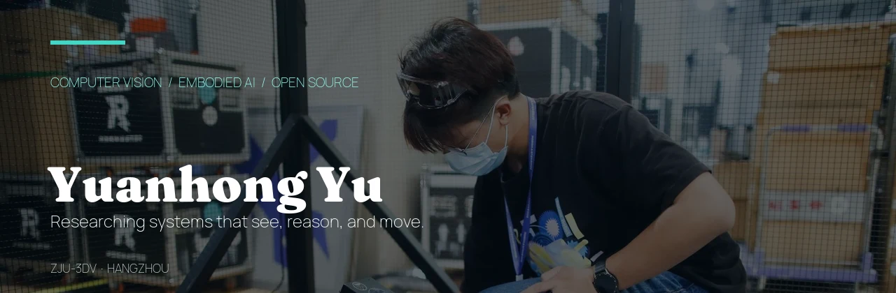
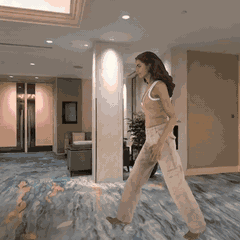
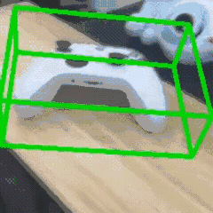

  
  
  
  

  Ph.D. student at <a href="https://github.com/zju3dv">ZJU-3DV</a>, advised by
  <a href="https://pengsida.net/">Sida Peng</a> and <a href="https://xzhou.me/">Xiaowei Zhou</a>.
   
  I work across 3D vision, embodied navigation, and open-source systems for AI agents.

## Selected research

### 01 / [Habitat-GS](https://github.com/zju3dv/habitat-gs) · ECCV 2026

A high-fidelity navigation simulator for dynamic Gaussian Splatting scenes, connecting photorealistic rendering with embodied navigation training and evaluation.

[Project page](https://zju3dv.github.io/habitat-gs/) · [Paper](https://arxiv.org/abs/2604.12626) · [Dataset](https://huggingface.co/datasets/RukawaY/gs_scenes)

 

### 02 / [BoxDreamer](https://github.com/zju3dv/BoxDreamer) · ICCV 2025

Generalizable 6-DoF object pose estimation from a single RGB image by predicting 3D bounding-box corners, without CAD models or category-specific training.

[Project page](https://zju3dv.github.io/boxdreamer/) · [Paper](https://arxiv.org/abs/2504.07955) · [Demo](https://huggingface.co/spaces/LittleFrog/BoxDreamer)

 

<strong>More research projects</strong>

 

- [central-voting-ppf](https://github.com/dadwadw233/central-voting-ppf) — point-cloud 6-DoF pose estimation in C++.
- [CityLayout](https://github.com/dadwadw233/CityLayout) — generative urban layout modeling with OpenStreetMap data.

## Open-source systems

### Team Collab

A file-backed collaboration protocol that keeps Claude Code, Codex, Cursor, and other coding agents aligned across sessions and multi-agent work.

[Repository](https://github.com/dadwadw233/team-collab-skills) · [npm · @embodot/collab](https://www.npmjs.com/package/@embodot/collab)

### VibePortrait

One command turns Claude Code and Codex history into a visual developer portrait and a reusable persona skill.

[Repository](https://github.com/dadwadw233/VibePortrait) · [Releases](https://github.com/dadwadw233/VibePortrait/releases)

<strong>More tools for agent builders</strong>

 

- [claude-code-harness](https://github.com/dadwadw233/claude-code-harness) — blueprint skill for designing agent runtimes.
- [agentop](https://github.com/dadwadw233/agentop) — terminal monitoring for coding agents.
- [claude-code-philosophy](https://github.com/dadwadw233/claude-code-philosophy) — vendor-neutral agent design principles.
- [VibeGuard](https://github.com/dadwadw233/VibeGuard) — local security guardrails for Claude Code.
- [QBot](https://github.com/dadwadw233/QBot) — personality reconstruction from chat history.
- [Lightning-AI/pytorch-lightning#20327](https://github.com/Lightning-AI/pytorch-lightning/pull/20327) — external contribution fixing BatchSampler compatibility.

## Experience

> **Embodied Navigation Research Intern** · [OneRobotics](https://www.onerobot.com/) Artificial Intelligence Research Institute, Hangzhou · *2026.07.17 — now*
>
> **3D Vision Research Intern** · [Ant Group](https://www.antgroup.com/en), with [Yujun Shen](https://shenyujun.github.io/) · *2024.12 — 2026.07.16*
>
> **Algorithm Intern** · [Deepglint](https://www.deepglint.com/) · *2024.07 — 2024.09*
>
> **3D Vision Research Intern** · [Shanghai AI Lab](https://www.shlab.org.cn/), with [Tong He](https://tonghe90.github.io/) · *2023.10 — 2024.06*
>
> **Robot Software Developer** · [NWPU-V5++](https://npuv5pp.github.io/V5Tutorial/) · *2021.03 — 2023.09*
