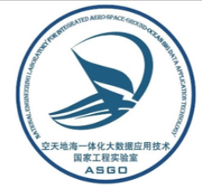

:stuck_out_tongue_winking_eye:  
[](https://git.io/typing-svg)
## About me :point_down:
<p align="center">
  <a href="https://github.com/dadwadw233">
    
  </a>
  <a href="https://github.com/dadwadw233">
    
  </a>
  <a href="https://github.com/dadwadw233?tab=repositories">
    
  </a>
  <a href="https://gist.github.com/dadwadw233">
    
  </a>
  <a href="https://github.com/dadwadw233">
    
  </a>
</p>

### :sweat_drops: Introduction

- :wink: I’m currently a undergraduate student from **Northwest Polytechnical University** and my major is **Computer Science and Technology**.
- :baby: Coming Master student in **CAD&CG** at **Zhejiang University** in the fall of 2024.
- 🌱 My research interests include Computer Vision；MultiModel task；Generative AI...
- You can get in touch with me by email at [yuanhongyu.me@gmail.com](mailto:yuanhongyu.me@gmail.com)
- My HomePage: [YYH`s Homepage](https://yuanhongyu.xyz/)

---

### 📗 Education Experience

[](https://www.nwpu.edu.cn/)

**undergraduate Student** \
[**NPU**](https://www.nwpu.edu.cn/) • 2020/09/01 - 2024/07/31 \
Skills: `Python`, `C++`, `3D Vision`, `Robot`, `etc.` \
Some Projects:[NPU AI Lesson](https://github.com/dadwadw233/NPU_AI_course) / [DataBase](https://github.com/dadwadw233/NPU-Survival-Manual) / [Super Naive CPU(mips)](https://github.com/dadwadw233/MIPS-CPU) 
<br/>

### ⛳ Work Experience

[](https://www.shlab.org.cn/)

**3D Vision Intern** \
[**sh AI lab**](https://www.shlab.org.cn/)• 2023/10/24 - now \
Research Interests: `Generative Model`, `LLM`  \
Featured Projects: Coming .... :computer:
<br>

[](https://www.nwpu.edu.cn/)

**3D Vision Intern** \
**ASGO-3DV** • 2022/01/01 - 2023/09/01 \
Research Interests: `Pose Estimation`, `Point Cloud Registration`, `Diffusion Model`  \
Supervisor：[**Jiaqi Yang**](https://yangjiaqihomepage.github.io/) \
Featured Projects: [Point Pair Feature Based Pose Estimation](https://github.com/dadwadw233/Central_Voting_PPF)(reproduce the [paper](https://ieeexplore.ieee.org/document/9429889)) 
<br>

[](https://npuv5pp.github.io/V5Tutorial/)
**Software Dev for Robot** \
[**NWPU-V5++**](https://npuv5pp.github.io/V5Tutorial/) • 2021/03/15 - 2023/09/01  @[nwpu-v5-team](https://github.com/nwpu-v5-team) \
Skills: `ROS`, `Path finding`, `Robot Positioning`, ... \
Competition experiences : `ICRA RoboMaster AI Challenge`, `ICRA RoboMaster Sim2Real Challenge` ... \
<br>

---
## About Github :zzz:
### :point_down: Overview
[](https://wakatime.com/@323402a1-bedf-4563-9d3c-6d8a3682f2bb)  

<div align="center">
<span>  </span>
<span>  </span>
<span>  </span>
</div>

---

### :alien: Contribution History
<div align="center">
    
</div>

--- 

### :snake: Snake!
<div align="center"></div>


### 🕘 Wakatime Activity
<div align="center">

</img>

</div>

### :muscle: My Weekly Development
<!--START_SECTION:waka-->

```txt
From: 11 November 2023 - To: 18 November 2023

Total Time: 16 hrs 10 mins

Other            31 hrs 41 mins  ████████████████▓░░░░░░░░   66.20 %
Python           10 hrs 56 mins  █████▓░░░░░░░░░░░░░░░░░░░   22.84 %
Bash             2 hrs 22 mins   █▒░░░░░░░░░░░░░░░░░░░░░░░   04.96 %
sh               2 hrs 21 mins   █▒░░░░░░░░░░░░░░░░░░░░░░░   04.92 %
Markdown         20 mins         ▒░░░░░░░░░░░░░░░░░░░░░░░░   00.71 %
```

<!--END_SECTION:waka-->
